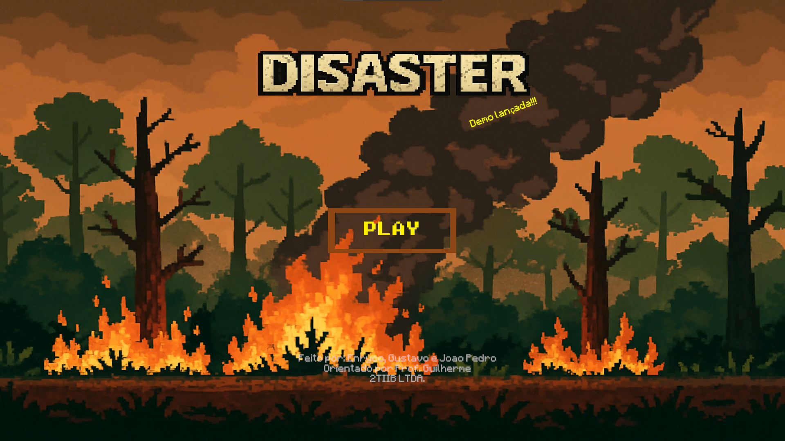
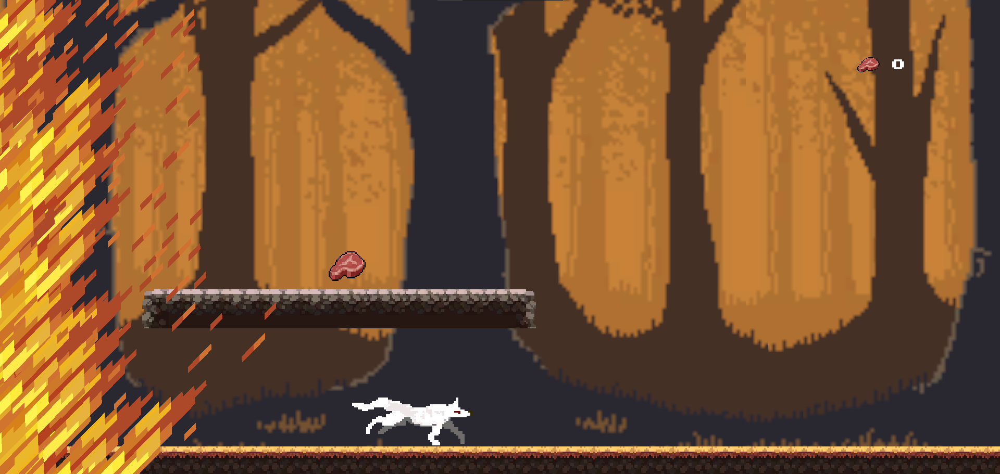
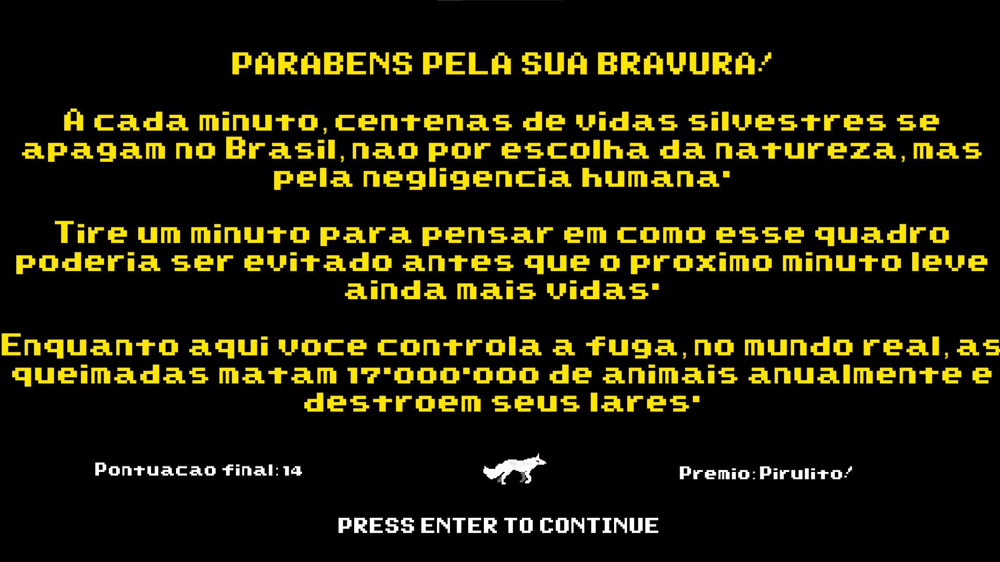

# 🔥 Disaster — Institutional Game

> Jogo educacional 2D desenvolvido para a Feira de Ciências e Tecnologias do Instituto Estadual Riachuelo, com o objetivo de conscientizar sobre o impacto do ser humano no meio ambiente.

---

## 🌿 Contexto

Em 2025, em meio ao cenário alarmante de queimadas na Amazônia, desenvolvemos o **Disaster**. Um jogo runner 2D onde o jogador controla um lobo fugindo do fogo em uma floresta devastada pelo desmatamento e pelas queimadas. O projeto foi criado em sala de aula em um período de 03 meses como iniciativa institucional de conscientização ambiental.

---

## 🖥️ Demonstração

<div align="center">

### Menu Principal


<br/>

### Gameplay


<br/>

### Tela Final


</div>

---

## 🎮 Sobre o Jogo

O jogador controla um lobo em um cenário de floresta em chamas. O objetivo é percorrer o percurso desviando dos obstáculos enquanto o fogo avança. Quanto mais **coletáveis** são pegos, maior a pontuação que resultava em um prêmio durante a apresentação do jogo na feira. Ao fugir do fogo a sua história é completa. tendo uma forte mensagem sobre as consequências das queimadas para a fauna.

---

## 🛠️ Tecnologias

- **Unity** — engine de desenvolvimento do jogo
- **C#** — linguagem de programação da lógica do jogo
- **ShaderLab / HLSL** — shaders para efeitos visuais (fogo e ambiente)

---

## 📁 Estrutura do Projeto

```
Disaster-Institutional-Game/
├── Assets/           # Sprites, scripts, cenas e animações
├── Packages/         # Pacotes do Unity
├── ProjectSettings/  # Configurações do projeto Unity
└── .gitignore        # Arquivos ignorados pelo Git
```

---

## 🚀 Como rodar o projeto

- [Unity Hub](https://unity.com/download) instalado

### Passos

1. Clone o repositório:
```bash
git clone https://github.com/enryco4real/Disaster-Institutional-Game.git
```

2. Abra o **Unity Hub**
3. Clique em **Open** e selecione a pasta clonada
4. Aguarde o Unity importar os assets
5. Abra a cena principal em `Assets/Scenes/` e clique em **Play**

---

## 💡 Aprendizados

Este projeto foi desenvolvido integralmente em sala de aula e representou o primeiro contato prático com:

- Desenvolvimento de jogos com Unity e C#
- Programação de mecânicas de runner (movimento, obstáculos, pontuação)
- Criação e animação de sprites 2D
- Trabalho em equipe com controle de versão

---

## 👤 Autor

Desenvolvido por **Enryco Guimarães Bauer** como projeto institucional solo de portfólio.

[](https://www.linkedin.com/in/enryco-bauer-51221a356)
[](mailto:enrycogbauer@gmail.com)
[](https://github.com/enryco4real)
